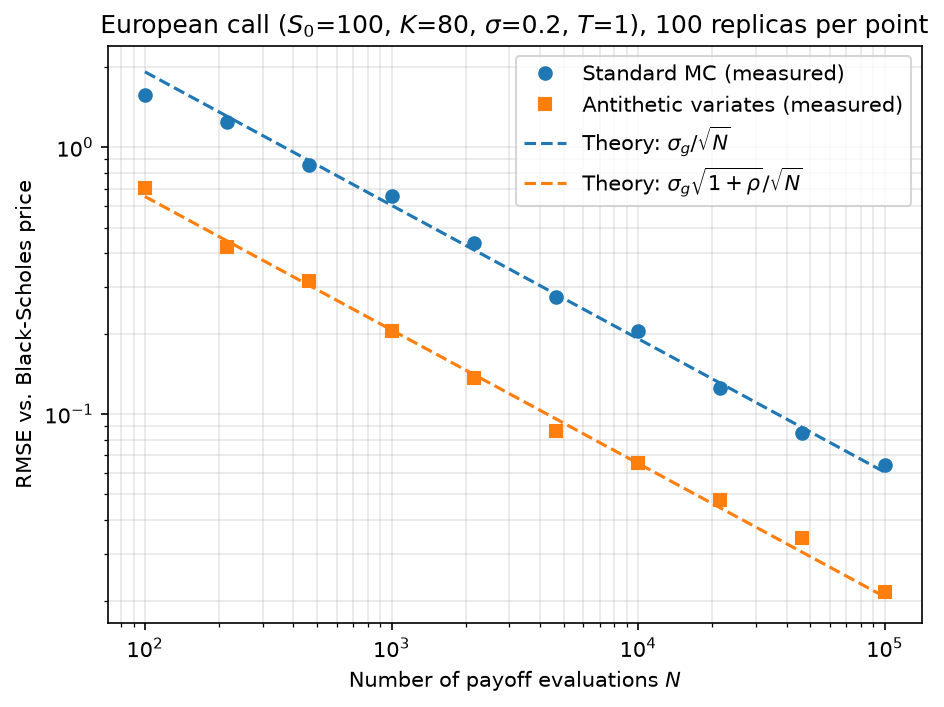
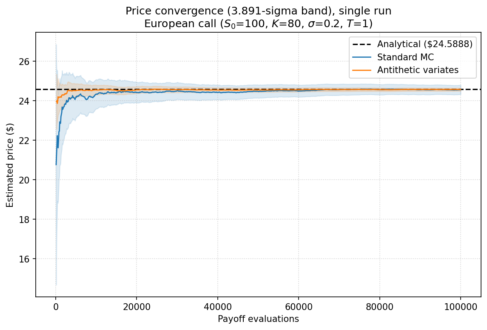

# bs-pricer

European option pricing in Python: closed-form Black–Scholes with Greeks, Monte Carlo
valuation under risk-neutral GBM, and antithetic variates for variance reduction — with
every numerical claim measured against theory rather than asserted.



RMSE against the analytical price, 100 replicas per point. Dashed lines are the theoretical
predictions with no fitted parameters: `sigma_g` and `rho` come from an independent pilot run.

## Results

| Quantity | Predicted | Measured |
|---|---|---|
| Variance reduction factor, antithetic | 0.1163 (`1 + rho`) | 0.1184 |
| Convergence rate, standard MC | −0.5 | −0.4819 ± 0.0110 |
| Convergence rate, antithetic | −0.5 | −0.4914 ± 0.0099 |
| Vertical offset, log₁₀ decades | −0.4672 | −0.4544 |

Measured with `rho = -0.8837` for an in-the-money call
(`S0=100, K=80, r=0.05, sigma=0.2, T=1`). The variance reduction factor is obtained by
replication, not from the closed-form standard error — see design notes below.



A single-run view of the same effect: cumulative price estimate and its 3.891-sigma band
as more payoffs are evaluated, for both methods at equal budget. Unlike the plot above,
this is one simulation run rather than an aggregate over 100 replicas — intuitive to read,
but subject to that run's own noise. The antithetic band is visibly narrower throughout.

## Install

The package supports Python 3.10+. Development uses Python 3.12 (`.python-version`), and
`requirements.txt` pins the exact dependency versions of that development environment —
those pins require Python 3.12. Install them before the package so the pinned versions are
used.

**Linux / macOS**

```bash
git clone https://github.com/javimarin23/bs-pricer.git
cd bs-pricer
python3.12 -m venv .venv
source .venv/bin/activate
python -m pip install -r requirements.txt
python -m pip install -e .
pytest
```

**Windows (PowerShell)**

```powershell
git clone https://github.com/javimarin23/bs-pricer.git
cd bs-pricer
py -3.12 -m venv .venv
.venv\Scripts\Activate.ps1
python -m pip install -r requirements.txt
python -m pip install -e .
pytest
```

If PowerShell blocks the activation script, run
`Set-ExecutionPolicy -Scope CurrentUser RemoteSigned` once, or skip activation and call
`.venv\Scripts\python.exe` directly.

## Usage

```python
from bs_pricer import call_price, griegas, simulate_ST, mc_pricer

S0, K, r, sigma, T = 100.0, 80.0, 0.05, 0.2, 1.0

# Closed-form price and Greeks
call_price(S0, K, r, sigma, T)          # 24.5888
griegas(S0, K, r, sigma, T, "call")     # {'Delta': 0.9286, 'Gamma': 0.0068, ...}

# Monte Carlo. n_evals is the payoff-evaluation budget.
ST = simulate_ST(S0, r, sigma, T, n_evals=400_000, seed=42)
price, stdev, se = mc_pricer(ST, K, r, T, "call")
```

Antithetic variates use paired simulation, at the same `n_evals` budget as standard MC:

```python
from bs_pricer import simulate_ST_antithetic, mc_pricer_antithetic

ST1, ST2 = simulate_ST_antithetic(S0, r, sigma, T, n_evals=400_000, seed=42)
price, se, rho, reduction_factor = mc_pricer_antithetic(ST1, ST2, K, r, T, "call")
```

## Layout

```
src/bs_pricer/     black_scholes.py, monte_carlo.py, utils.py
tests/             9 tests, pytest
scripts/           comparacion_antiteticas.py, convergencia_loglog.py
figures/           convergence plot
```

Run `pytest` for the test suite, or either script for the numbers in the table above.

## Design notes

**Exact GBM transition, not Euler–Maruyama.** GBM has a closed-form transition density, so
`S_T` is drawn directly. Discretising would add a bias that buys nothing for a European
payoff.

**`n_evals`, not `N`, in both simulators.** Standard and antithetic MC are only comparable
at equal payoff-evaluation budget: `simulate_ST_antithetic` draws `n_evals // 2` normals,
each used twice. Naming the parameter `n_evals` in both functions makes an equal-budget
comparison the default rather than something the caller has to remember.

**Variance reduction validated by replication, not by the standard error.** Comparing
`SE_anti / SE_std` from a single run is circular: both come from the same CLT formula, and
the ratio is algebraically `1 + rho` whatever the code does. The factor is instead measured
as a ratio of variances across 1000 independent replicas — a measurement that uses no
formula, and that catches errors in the standard error itself.

**RMSE measured against the analytical price, not the mean of replicas.** `MSE = bias² +
variance`. Using the replica mean as reference would cancel the bias term by construction,
and a systematic error would stay invisible. Against the exact price, bias shows up as the
convergence curve flattening out.

**Independent seeds per (N, replica).** Reusing seeds across sample sizes nests the samples:
the `N`-point estimate shares half its data with the `2N` one, correlating neighbouring
errors. The curve looks smoother but is displaced as a block, and the least-squares slope
estimate assumes independent residuals.

**Test tolerances derived from expected noise, never from observed error.** Each tolerance
comes from the noise of its own statistic: `2/sqrt(R)` for a ratio of two variances,
`1/sqrt(2R)` for an RMSE or a standard error, machine epsilon for put–call parity,
truncation-vs-round-off analysis for finite-difference checks. Setting a tolerance from what
a given run happened to produce defeats the purpose of the test.

**Test coverage verified by mutation.** Deliberately breaking the code confirmed that the
tests catch it. Two cases motivated extra assertions: non-antithetic pairing leaves
predicted and empirical variance-reduction factors agreeing at 1.0 (caught by an explicit
`factor < 1` check), and a standard error computed over `2M` "independent" samples instead
of `M` pairs passes both the unbiasedness and the variance-ratio tests (caught by a third
test comparing the reported SE against the empirical spread across replicas).

## Possible extensions

Control variates (`Y = exp(-rT)·S_T`, with `E[Y] = S_0` by the martingale property of the
discounted asset under Q), importance sampling for deep out-of-the-money options where
antithetic correlation degenerates, and path-dependent payoffs, which reintroduce
discretisation bias.

## License

MIT.
